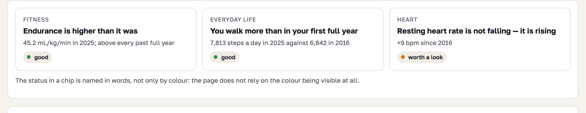
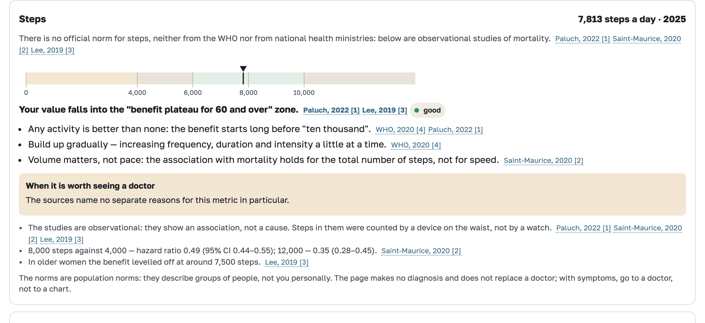
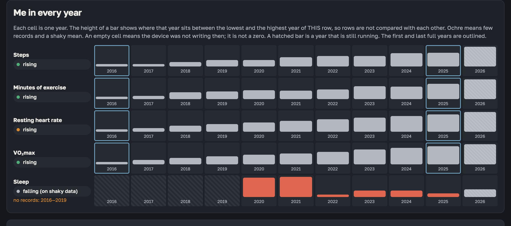
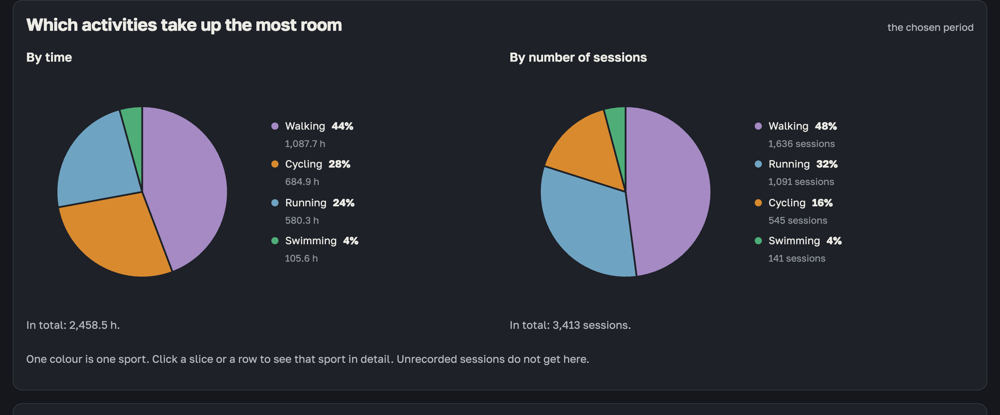

# health-dashboard

Turn an Apple Health export into a dashboard of your own long-term trends — activity,
workouts, heart and sleep — entirely on your own machine. The first screen, "Main",
sets your numbers against published guidelines (WHO and others, each with its source);
the other tabs show the series themselves and how complete the records are.

The page speaks Russian and English. It picks one from the browser locale and the
RU/EN button in the header changes it for the session; like the theme, the choice is
never written to disk. Most of the documentation is in Russian; this README, the data
contract and the development notes are in English. **Русская версия этого файла —
[README.ru.md](README.ru.md).**









*Screens from the synthetic archive that `demo` writes — nobody's real data. The first two in the light theme, the last two in the dark one.*

## One way in

```sh
python3 -m health_dashboard demo --open
```

This writes `out/demo/dashboard.html` — the page — and `fake_archive.zip` beside it,
a synthetic Apple Health export. The page opens with an invitation: year of birth and
sex (only for the WHO reference ranges), then **"Open the archive"**. Pick the fake
archive to see what you would get, or your own `export.zip` to see your data. While the
archive is read, the page leafs through the years from your birth year to today; then
the screens appear.

The archive is parsed in the browser. It never goes through the command line, and
nothing is written to disk — which also means nothing is kept: closing the tab discards
the result and the next visit parses the archive again.

Nothing else is needed: Python 3.9 or newer, standard library only, no packages to
install, no build step. On macOS the system Python at `/usr/bin/python3` is enough.
Run the commands from the directory you cloned this repository into. Exporting the
archive from an iPhone is described in [docs/ru/EXPORT.md](docs/ru/EXPORT.md). Pass the
`.zip` whole; do not unpack it.

## The reference path

```sh
python3 -m health_dashboard build path/to/export.zip -o out/dashboard --open
```

```sh
python3 -m health_dashboard verify out/dashboard
```

`build` reads the archive in Python and writes `dashboard.html` with the numbers
embedded and a `data/` folder beside it; `verify` re-checks that the numbers in the
result agree with each other. Python is the reference implementation: the page is
required to produce the same numbers, and `tests/test_archive_equivalence.py` fails if
it does not — on the synthetic fixtures and on the fake archive. To check the two
against each other on your own export, run `python3 tests/ui/compare_real.py
path/to/export.zip` (needs Node): it prints only "matched / did not match" and the paths
that differ, never a value. For a very large archive prefer `build`: measured time and
memory are in [docs/ru/LIMITATIONS.md](docs/ru/LIMITATIONS.md).

## No server, no network, no account

The program never opens a network connection. The dashboard it writes is one HTML
file with a `connect-src 'none'` policy, so it cannot call out either. There is
nothing to sign up for and nothing to upload. What the program reads and what it
writes stay in the folder you chose — see [docs/ru/PRIVACY.md](docs/ru/PRIVACY.md)
for what that does and does not protect you from.

## What it does not do

- It is **not a medical device** and it does not diagnose anything. "Main" compares
  your numbers with general population guidelines and quotes their general advice,
  including when a doctor is worth asking; none of it is advice about you.
- It does not explain causes, test significance or predict anything.
- It does not reproduce the numbers the Health app shows you. Health applies its own
  source priority, which the export does not contain; this program picks one source
  per day by a stated, reproducible rule instead. Expect differences and read
  [docs/ru/METHODOLOGY.md](docs/ru/METHODOLOGY.md) before treating one of them as a
  finding.
- It does not fill in missing days. A gap is a gap, never a zero.
- It does not give personal advice, set targets for you or score your health.

The limits worth knowing before you read any number are listed in
[docs/ru/LIMITATIONS.md](docs/ru/LIMITATIONS.md).

## Documentation

| File | What it answers |
|---|---|
| [docs/ru/EXPORT.md](docs/ru/EXPORT.md) | How to get the archive off the iPhone |
| [docs/ru/PRIVACY.md](docs/ru/PRIVACY.md) | What stays local, and what "local" does not cover |
| [docs/ru/METHODOLOGY.md](docs/ru/METHODOLOGY.md) | How a day, a night and a month are built |
| [docs/ru/LIMITATIONS.md](docs/ru/LIMITATIONS.md) | What the numbers cannot tell you |
| [docs/ru/UI.md](docs/ru/UI.md) | What each screen shows and how it behaves |
| [docs/DATA_CONTRACT.md](docs/DATA_CONTRACT.md) | The shape of the aggregates the interface reads |
| [docs/DEVELOPMENT.md](docs/DEVELOPMENT.md) | Layout, tests, how to add a metric |

## Tested on

macOS, Python 3.9.6, the interface in Chrome. Windows, Linux, Safari and Firefox are
untested — nothing platform-specific is used, but nobody has run it there yet. Reading
the archive in the page needs `DecompressionStream` (Chrome and Edge 80+, Firefox 113+,
Safari 16.4+); the page checks for it and says so plainly when it is missing. The page
is a single file of about 300 KB with the typeface embedded; it works from disk, with
no server. Reports are welcome.

## License

MIT. See [LICENSE](LICENSE). The embedded typeface, Golos Text, is under the SIL Open
Font License — see [health_dashboard/ui/fonts/OFL.txt](health_dashboard/ui/fonts/OFL.txt).
