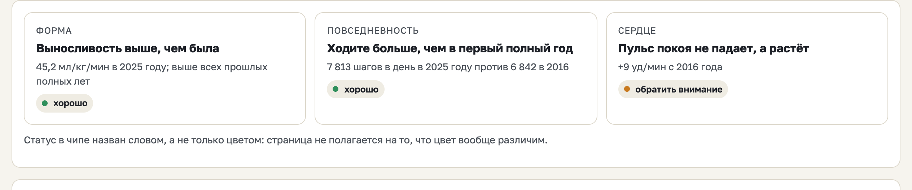
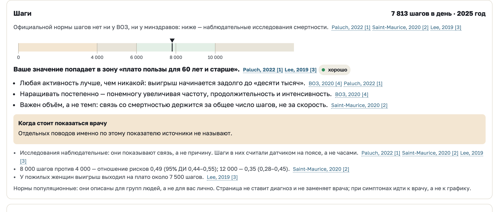
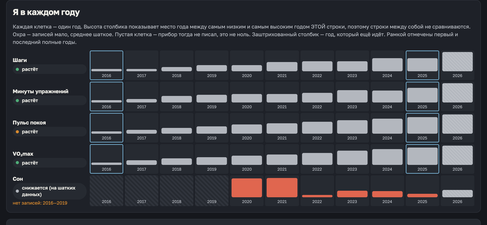
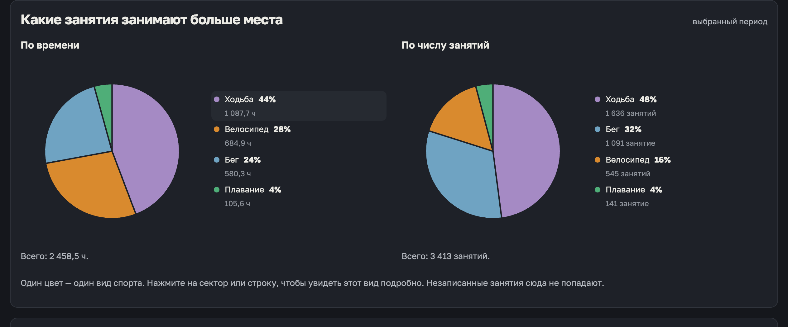

# health-dashboard

Выгрузка из приложения «Здоровье» превращается в страницу с вашими многолетними
трендами — движение, тренировки, сердце и сон — целиком на вашем компьютере. Первый
экран, «Главное», ставит ваши числа рядом с опубликованными ориентирами (ВОЗ и другие,
у каждого указан источник); остальные вкладки показывают сами ряды и полноту записей.

Страница говорит по-русски и по-английски. Какой язык показать, она берёт из локали
браузера, а кнопка «RU/EN» в шапке переключает его на этот сеанс; как и тема, выбор
на диск не пишется.

English version: [README.md](README.md).









*Экраны на синтетическом архиве, который кладёт `demo`, — ничьи не настоящие данные. Первые два в светлой теме, вторые два в тёмной.*

## Один путь

```sh
python3 -m health_dashboard demo --open
```

Команда пишет `out/demo/dashboard.html` — саму страницу — и рядом `fake_archive.zip`,
синтетическую выгрузку Apple Health. Страница открывается приглашением: год рождения и
пол (только для ориентиров ВОЗ), затем **«Открыть архив»**. Выберите синтетический
архив, чтобы посмотреть, что получится, или свой `export.zip`, чтобы увидеть свои
данные. Пока архив читается, страница листает годы от вашего рождения к сегодняшнему
дню; потом появляются экраны.

Архив разбирается в браузере. Он не проходит через командную строку, на диск ничего не
пишется — а значит, ничего и не хранится: закрыли вкладку — результат исчез, при
следующем открытии архив читается заново.

Больше ничего не нужно: Python 3.9 или новее, только стандартная библиотека, никаких
пакетов и сборки. На macOS хватает системного `/usr/bin/python3`. Команды запускаются
из папки, в которую вы клонировали репозиторий. Как выгрузить архив с iPhone — в
[docs/ru/EXPORT.md](docs/ru/EXPORT.md). Отдавайте `.zip` целиком, не распаковывайте.

## Эталонный путь

```sh
python3 -m health_dashboard build путь/к/export.zip -o out/dashboard --open
```

```sh
python3 -m health_dashboard verify out/dashboard
```

`build` читает архив на Python и пишет `dashboard.html` с уже встроенными числами и
папкой `data/` рядом; `verify` перепроверяет, что числа в результате согласованы между
собой. Python — эталонная реализация: страница обязана давать те же числа, и
`tests/test_archive_equivalence.py` падает, если это не так — на синтетических
фикстурах и на `fake_archive.zip`. Чтобы сверить оба пути на своей выгрузке, запустите
`python3 tests/ui/compare_real.py путь/к/export.zip` (нужен Node): он печатает только
«совпало / не совпало» и пути расхождений, никогда — значения. Для очень большого
архива предпочтительнее `build`: измеренные время и память — в
[docs/ru/LIMITATIONS.md](docs/ru/LIMITATIONS.md).

## Без сервера, без сети, без учётной записи

Программа не открывает сетевых соединений. Страница, которую она пишет, — один
HTML-файл с политикой `connect-src 'none'`, так что и она никуда обратиться не может.
Регистрироваться негде, загружать некуда. Что программа читает и что пишет, остаётся в
выбранной вами папке — что это защищает, а что нет, написано в
[docs/ru/PRIVACY.md](docs/ru/PRIVACY.md).

## Чего программа не делает

- Это **не медицинское изделие**, и оно ничего не диагностирует. «Главное»
  сопоставляет ваши числа с ориентирами для населения в целом и цитирует их общие
  рекомендации, включая то, когда стоит спросить врача; ничто из этого не совет лично
  вам.
- Не объясняет причины, не проверяет значимость, ничего не предсказывает.
- Не воспроизводит числа из приложения «Здоровье». У приложения свои приоритеты
  источников, которых в выгрузке нет; программа вместо этого берёт один источник на
  день по объявленному, воспроизводимому правилу. Расхождения будут — прочитайте
  [docs/ru/METHODOLOGY.md](docs/ru/METHODOLOGY.md), прежде чем считать одно из них
  находкой.
- Не дорисовывает пропущенные дни. Пропуск — это пропуск, а не ноль.
- Не даёт личных советов, не ставит целей и не выставляет оценок здоровью.

Ограничения, которые стоит знать до того, как читать любое число, собраны в
[docs/ru/LIMITATIONS.md](docs/ru/LIMITATIONS.md).

## Документация

| Файл | На какой вопрос отвечает |
|---|---|
| [docs/ru/EXPORT.md](docs/ru/EXPORT.md) | Как снять архив с iPhone |
| [docs/ru/PRIVACY.md](docs/ru/PRIVACY.md) | Что остаётся локально и чего «локально» не покрывает |
| [docs/ru/METHODOLOGY.md](docs/ru/METHODOLOGY.md) | Как складываются день, ночь и месяц |
| [docs/ru/LIMITATIONS.md](docs/ru/LIMITATIONS.md) | Чего числа сказать не могут |
| [docs/ru/UI.md](docs/ru/UI.md) | Что показывает каждый экран и как себя ведёт |
| [docs/DATA_CONTRACT.md](docs/DATA_CONTRACT.md) | Форма агрегатов, которые читает интерфейс (по-английски) |
| [docs/DEVELOPMENT.md](docs/DEVELOPMENT.md) | Раскладка, тесты, как добавить показатель (по-английски) |

## Проверено на

macOS, Python 3.9.6, интерфейс в Chrome. Windows, Linux, Safari и Firefox не
проверялись — ничего платформенного не используется, но там никто не запускал. Чтению
архива в странице нужен `DecompressionStream` (Chrome и Edge 80+, Firefox 113+, Safari
16.4+); страница проверяет его наличие и прямо говорит, если его нет. Страница — один
файл около 300 КБ со встроенным шрифтом; работает с диска, без сервера. Сообщения о
проблемах приветствуются.

## Лицензия

MIT, см. [LICENSE](LICENSE). Встроенный шрифт Golos Text — под SIL Open Font License,
см. [health_dashboard/ui/fonts/OFL.txt](health_dashboard/ui/fonts/OFL.txt).
